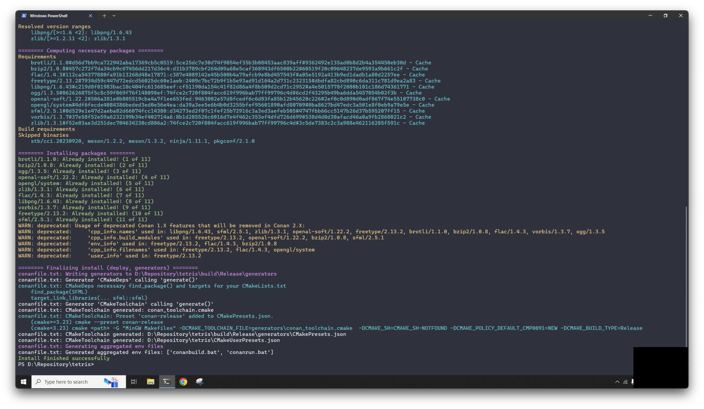

# Tetris

[](https://opensource.org/licenses/MIT)

## _A cross-platform game built with SFML_

[](https://www.sfml-dev.org)

## Table of Contents

- [Introduction](#introduction)
- [Features](#features)
- [Installation](#installation)
- [License](#license)
- [Contact](#contact)

## Introduction

This is one of my school projects written in C++. Now, it's open source for anyone who is interested in C programming.

## Features


| Command | Behavior |
| ------ | ------ |
| `Left` | Move left |
| `Right` | Move right |
| `Down` | Faster drop |
| `Space` | Instant drop |
| `X` or `Z` | Rotate block |

## Installation

First, you'll need to install Conan 2, a C and C++ package manager.

Next, create a Conan profile:

```
conan profile list
conan profile show -pr default
```

Here is my profile configuration for reference:

| Macos | Windows |
| ------ | ------ |
| [settings] | [settings] |
| arch=x86_64 | arch=x86_64 |
| build_type=Release | build_type=Release |
| compiler=apple-clang | compiler=gcc |
| compiler.cppstd=gnu17 | compiler.cppstd=14 |
| compiler.libcxx=libc++ | compiler.libcxx=libstdc++11 |
| compiler.version=15 | compiler.version=13 |
| os=Macos | os=Windows |

Once you have configured your Conan profile, navigate to the project directory to pull dependencies.

```sh
conan install conanfile.txt --build=missing
```

You will notice that a CMakeUserPresets.json file is generated, making it easy to use the new CMake command.

```sh
conanfile.txt: CMakeToolchain generated: CMakeUserPresets.json
```

Then, run these commands to build the app:

```sh
cmake --preset conan-release
cmake --build --preset conan-release
```

Alternatively, you can use Visual Studio Code to compile, checkout the configuration from the `vscode` branch:

| OS | Build |
| ------ | ------ |
| Macos | `Command` + `Shift` + `B`|
| Windows | `Ctrl` + `Shift` + `B` |

After that, the build is successfully created in the `build/Release` folder.

```sh
-- Build files have been written to: tetris/build/Release
```

Finally, to run the game, navigate to the Release folder in the terminal, then run the command:

```
./tetris
```

[](https://www.youtube.com/watch?v=ALfD8xY2wsA)

## License

This project is licensed under the MIT License. See the [LICENSE](https://github.com/pixelcarrot/tetris/blob/readme/LICENSE) file for details.

## Contact

For any inquiries or feedback, please contact Justin at justin@pixelcarrot.com or visit [pixelcarrot.com](http://pixelcarrot.com).
